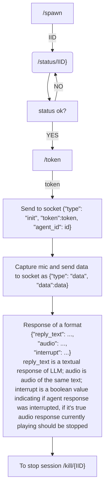

## Introduction

The sample workflow script for [eigenchat](https://eigenchat.com) websocket Agent api

For script to work you should first create API key in the dashboard and after that
create first agent config with /api/agent method(check out REST API [docs](https://eigenchat.com/api/docs))

After that fill out `apiKey` and `agentId` variables in `src/App.js`

To start the client run:

### `npm start`

Open [http://localhost:3000](http://localhost:3000) to view it in your browser.

### Example agent config

`{"system_prompt": "You're friendly AI agent", "base_prompt": "Your answers are turned to speech so replies should be short enough to feel natural.", "lang": "en"}`

### Workflow
1. Create a new session with the /spawn method, it will return your session ID. Creation of session can take about 3 minutes
2. Monitor state of the session with /status/{ID} method. When the session is ready it'll give you URL and port of websocket.
3. Get access token with /token method, you'll need to pass ID of session and expiration time for this token. The token will only work for that about of time and only for this session ID.
4. Initiate connection with websocket by sending init message with valid access token and agent ID to use in conversation.
5. Capture user's microphone and send audio as it becomes available. Service is expecting audio to be 16 kHz sample rate and base64 encoded
6. As you receive audio from the bot schedule it to be played(after precious responses have been played)
7. You may receive "interrupt": true field in your response. It's means that the user have interrupted agent, so you should stop playing current audio chunk and remove any chunks scheduled to play after that.
8. Stop the session with /kill/{ID} method.

### Websocket messages
#### Init:
`{"type": "init", "token": access_token, "agent_id": id}`
#### Audio data message
`{"type": "data", "data": base64_encoded_audio}`

Audio should be 16000 samples per second base64 encoded

### Websocket response messages

#### Init response
If successful: `{"status": "ok"}`
If auth failed: `{"status": "error", "message": error_message}`
#### Data response
`{"reply_text": reply_text, "audio": audio, "interrupt": interrupt, "chunk_count": count, "id": reply_id}`
some of the fields may be missing in some responses(e.g. reply_text will first appear without audio).

"reply_text" is a chunk of agent's reply in the text form;

"audio" is the audio form for the corresponding text;

"chunk_count" is the number of reply chunk for the current reply, it starts from 0;

"id" is a string ID of the current reply.

### Example responses
E.g. user asks bot: "What's your name?". The bot may reply something like: "I'm an AI, so I don't have a name. What's yours?"
The client will receive the following sequence of responses:
1. `{"reply_text": "I'm an AI", "chunk_count": 0, "id": ...}`
2. `{"reply_text": "I'm an AI", "chunk_count": 0, "id": ..., "audio": ...}`
3. `{"reply_text": "so I don't have a name", "chunk_count": 1, "id": ...}`
4. `{"reply_text": "so I don't have a name", "chunk_count": 1, "id": ..., "audio": ...}`
5. `{"reply_text": "What's yours?", "chunk_count": 2, "id": ...}`
6. `{"reply_text": "What's yours?", "chunk_count": 2, "id": ..., "audio": ...}`

### Workflow diagram
